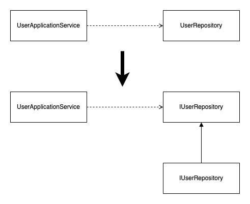

# 依存とは

依存はあるオブジェクトからあるオブジェクトを参照するだけで発生する。

例えば以下のコードでは`ObjectA`は`ObjectB`に依存していると言える。

```php
class ObjectA
{
    private ObjectB $objectB;
}
```

これはインターフェースとその実装クラスにもいえる。

`UserRepository`クラスは`IUserRepository`インターフェースを実装していて、`IUserRepository`の定義が存在しなかったらエラーとなる。

つまり`UserRepository`クラスは`IUserRepository`インターフェースに依存している状態。

```php
interface IUserRepository
{
    public function find(UserID $id) :User
}

class UserRepository implements IUserRepository
{
    public function find(UserID $id) :User
    {
        // snip
    }
}
```

アプリケーションサービスはリポジトリインタークラスを直接利用(依存)するのではなく、インターフェース(抽象型)を利用するようにする。

インターフェースを利用することで、テストではインメモリDBを利用するなど柔軟に対応できるため。

# 依存関係逆転の原則とは

依存関係逆転の原則(Dependency Inversion Principle)は以下のように定義されている。

- 上位レベルのモジュールは下位レベルのモジュールに依存してはならない。どちらのモジュールも抽象に依存すべきである。
- 抽象は、実装の詳細に依存してはならない。実装の詳細が抽象に依存すべきである。

依存関係逆転の原則はソフトウェアを柔軟なものに変化させ、ビジネスロジックを技術的な要素から守るのに欠かせないもの。

## 抽象に依存せよ

`UserRepository`と`UserApplicationService`で見ると、前者は下位レベルで後者は上位レベルになる。

抽象型を使わない場合、「上位レベルのモジュールは下位レベルのモジュールに依存してはならない」という原則に反してしまう。

この依存の関係は`UserApplicationService`が抽象型の`IUserRepository`を参照するようになると以下のようになる。



抽象型を導入することでどちらも抽象型に依存の矢印が伸びることになり、上位レベルのモジュールが下位レベルのモジュールに依存しなくなる。

また、「どちらのモジュールも抽象に依存すべきである」という原則にも合致し、もともと具体的な実装に依存していたものが抽象に依存するように依存関係は逆転する。

一般的に抽象型はそれを利用するクライアントが要求する定義で、`IUserRepository`は`UserApplicationService`のために存在しているとも言える。

`IUserRepository`という抽象にあわせて`UserRepository`の実装を行うことは、方針の主導権を`UserApplicationService`に握らせることと同義。

「抽象は実装の詳細に依存してはならない。実装の詳細が抽象に依存すべきである」という原則はこのようにして守られる。

## 主導権を抽象に

伝統的なソフトウェア開発手法では高レベルなモジュールが低レベルなモジュールに依存する形で作成される傾向があった。 言い換えると抽象が詳細に依存している状態。

抽象が詳細に依存するようになると、低レベルのモジュールにおける方針の変更が高レベルのモジュールに波及してしまう。

重要なドメインのルールが含まれるのはいつでも高レベルなモジュールで、低レベルなモジュールの変更を理由に、重要な高レベルのモジュールを変更するのは不自然。
(例えばデータストアの変更を理由にビジネスロジックを変更するなど)

主体となるべきは高レベルなモジュール(抽象)で低レベルなモジュールが主体となるべきではない。

高レベルなモジュールは低レベルのモジュールを利用するクライアントで、クライアントがするべきはどのような処理を呼び出すかの宣言のみ。

インターフェースはそれを利用するクライアントが宣言するものであり、主導権はクライアントにある。

インターフェースを宣言し、低レベルのモジュールはそのインターフェースにあわせて実装を行うことで、より重要な高次元の概念に主導権を握らせることが可能になる。

## 依存関係をコントロールする

`UserApplicationService`の依存関係をコントロールしてみる。

テストはインメモリリポジトリ、リリースビルドはRDBリポジトリを利用するパターン。

```php
class UserApplicationService
{
    private IUserRepository $userRepository;
    public function __construct()
    {
        $this->userRepository = new InMemoryUserRepository();
    }
}
```

上記の場合、フィールドは抽象型であるものの具象クラスを内部でインスタンス化しているため、`UserApplicationService`が`InMemoryUserRepository`に依存しているのでNG。

### Service Locatorパターン

Service
Locatorパターンは、ServiceLocatorと呼ばれるオブジェクトに依存解決先となるオブジェクトを事前に登録しておき、インスタンスが必要となる各所でServiceLocatorを経由してインスタンスを取得するパターン。

```php
class UserApplicationService
{
    private IUserRepository $userRepository;
    public function __construct()
    {
        // ServiceLocator経由でインスタンスを取得する
        $this->userRepository = ServiceLocator.resolve(IUserRepository::class);
    }
}
```

返却される実際のインスタンスはスタートアップスクリプトなどで事前に登録しておく。

```php
ServiceLocator.register(IUserRepository::class, InMemoryUserRepositry::class);
```

リリースビルド時は以下のようにスタートアップスクリプトを変更することで、一括切り替えすることが可能。

また、環境変数やコンフィグなどでスクリプトを切り替えるようしておくとわざわざ修正は不要になる。

```php
ServiceLocator.register(IUserRepository::class, UserRepositry::class);
```

ServiceLocatorパターンは大掛かりな仕掛けを用意する必要がないため導入しやすいのが特徴。

ただし以下の理由からアンチパターンとも言われている。

- 依存関係が外部から見えづらくなる
- テストの維持が難しくなる

#### 依存関係が外部からみえづらくなる

クラス定義を見ただけでは、事前にServiceLocatorに対して依存解決の設定する必要があることがわかりづらい。

コメントによる補足も、コメントは実際のコードと乖離することがある以上、解決策としては上策ではない。

#### テストの維持が難しくなる

例えば新たなフィールドが追加された際に、依存解決の登録を忘れてテストが破壊されることがある。

```php
class UserApplicationService 
{
    private IUserRepository $userRepository;
    private IFooRepository $fooRepository; // 追加された
    public function __construct()
    {
        $this->userRepository = ServiceLocator.resolve(IUserRepository::class);
        $this->fooRepository = ServiceLocator.resolve(IFooRepository::class); // 未登録
    }
}
```

テストが破壊されること自体が問題ではなく、実行するまでわからないことが問題。

開発者にとってテストは自身を助けるものだが、同時に途方もなく面倒なものでテストを維持するにはある程度の強制力が必要である。

今回の依存関係の変更に自然と気づき、テストコードの変更を余儀なくさせる強制力をもたせることができなければ、テストは維持されなくなってしまう可能性がある。

### IoC Containerパターン

IoC Container(DI Container)の前にDependency Injectionパターンについて知る必要がある。 DIパターンは依存の注入という言われる。

以下は`UserApplicationService`に`InMemoryUserRepository`に対する依存を注入(DI)している。

```php
$userRepository = new InMemoryUserRepository();
$userApplicationService = new UserApplicationService($userRepository);
```

この形式はコンストラクタで依存するオブジェクトを注入しているのでコンストラクタインジェクションとも呼ばれる。

DIパターンはこれ以外にもメソッドで注入するメソッドインジェクションなど多くのパターンが存在する。いずれも依存するモジュールを外部から注入することに変わりはない。

DIパターンであれば依存関係の変更に強制力をもたせられる。

```php
class UserApplicationService 
{
    private IUserRepository $userRepository;
    private IFooRepository $fooRepository;
    public function __construct(IUserRepository $userRepository, IFooRepository $fooRepository)
    {
        $this->userRepository = $userRepository;
        $this->fooRepository = $fooRepository
    }
}
```

`UserApplicationService`では新たな依存関係を追加するためのコンストラクタに引数が追加されるため、`UserApplicationService`
をインスタンス化して実施しているテストはコンパイルエラーによって実行できなくなる。

テストを実行するためにはまずコンパイルエラーを解消する必要があり、この強制力は大きい。

便利な一方で、依存するオブジェクトのインスタンス化をあちこちに記述する必要があり、テストとプロダクションへの切り替えはその依存させたいリポジトリ全てを差し替える必要が出てしまう。

この問題を解決するのがIoC Containerパターン。

```php
// IoC Container
$serviceCollection = new ServiceCollection();
// 依存関係の設定を登録する
$serviceCollection.addTransient(IUserRepository::class, InMemoryUserRepository::class);
$serviceCollection.addTransient(UserApplicationService::class);

// インスタンスはIoC Container経由で取得する
$provider = $serviceCollection.buildServiceProvider();
$userApplicationService = $provider.getService(UserApplicationService::class);
```

IoC Containerは設定にしたがって依存の解決を行い、インスタンスを生成する。

処理の流れとしては以下の通り。

1. `$provier.getService()`が呼び出されIoC Containerは`UserApplicationService`を生成しようとする。
2. `UserApplicationService`はコンストラクタで`IUserRepository`を必要とするので、内部的に依存関係を解決し、`IUserRepositry`を取得しようとする。
3. `IUserRepository`は`InMemoryUserRepository`を利用するように登録されているので、`UserApplicationService`は`InMemoryUserRepository`
   のインスタンスを受け取り、インスタンス化される

IoC Containerに対する設定方法はServiceLocatorと同じくスタートアップスクリプトなどで行う。

