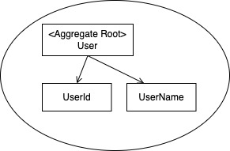

# 集約とは

オブジェクト指向プログラミングでは複数のオブジェクトがまとめられ、ひとつの意味をもったオブジェクトが構築される。

こうしたオブジェクトのグループには維持されるべき不変条件が存在する。

不変条件は常に維持されることが求められるが、オブジェクトのデータを変更しようとする操作を無制限に受け入れてしまうとそれは難しくなるので、オブジェクトの操作には秩序が必要になる。

集約は不変条件を維持する単位として切り出され、オブジェクトの操作に秩序をもたらす。

集約には境界とルートが存在する。集約の境界は集約に何が含まれるのかを定義するための境界で、ルートは集約に含まれる特定のオブジェクト。

外部からの集約に対する操作は全てルートを経由して行われる。集約の境界内に存在するオブジェクトを外部にさらけ出さないことで、集約内の不変条件を維持できるようにしている。

## 集約の基本的構造
集約は関連するオブジェクト同士を線で囲う境界として定義される。



集約の外部から境界の内部のオブジェクトを操作してはならない。集約を操作するための直接のインターフェースとなるオブジェクトは集約ルート(Aggregate Root)と呼ばれるオブジェクトに限定され、集約内部のオブジェクトに対する変更は、集約ルートが責任をもって行うことで集約内部の不変条件を保つ。

例えば`UserName`を直接操作してよいのは集約ルートである`User`のみで、ユーザー名の変更は`User`オブジェクトに依頼をする形で変更しなくてはならない。

```php
$userName = new UserName('NewName');

// NG
$user->name = $userName;

// OK
$user->changeName($userName);
```

いずれの操作もその結果に違いはないが、`changeName`といったメソッドを用意することで渡された引数のチェックが行える。


サークル集約に含まれるサークル名などを操作して良いのは集約ルートである`Circle`で、サークルのメンバーを追加する場合も同様で集約ルート越しに操作する必要がある。

ユーザー集約はサークル集約に含まれないため、ユーザー集約の情報を変更するような操作はサークル集約からは行わないが、サークルにメンバーとしてユーザーを追加するといった関連の操作はサークル集約が行う。

```php
$circle->members->add($member);
```

上記のようなコードは集約のルールに違反している。サークル集約の内部に含まれる`members`は集約ルートである`Circle`が操作すべきで、以下のように`Circle`オブジェクトにメソッドを追加することが推奨される。

```php
class Circle
{
    private CircleId $id;
    private User $owner;
    private array $members;
    
    public function join(User $member)
    {
        if (count($this->members) >= 29) {
            throw new CircleFullException($this->id);
        }
        
        $this->members[] = $member;
    }
}
```

`join`メソッドはユーザーをメンバーとして追加する際に上限チェックを行い、またメンバーを追加する際には`join`
メソッドを呼び出す以外に方法はなく、結果としてメンバーを追加する際には上限チェックが行われ、30名までという不変条件は常に維持されることになる。

```php
$circle->join($user);
```

呼び出し元は上記のようになり、直接プロパティに対してメンバーを追加していた時と比べ、より直感的なものになる。
→「サークルのメンバーにユーザーを追加する」から「サークルにユーザーを所属させる」

オブジェクト指向プログラミングでは、外部から内部のオブジェクトをに対して直接操作するのではなく、それを保持するオブジェクトに依頼する形を取る。

そうすることで直感的に、かつ不変条件を維持することができ「デメテルの法則」としても知られている。

## オブジェクトの操作に関する基本的な原則

オブジェクト同士が無秩序にメソッドを呼び出し合うと、不変条件を維持することは難しくなる。「デメテルの法則」はオブジェクト同士のメソッド呼び出しに秩序をもたらすガイドラインとなる。

デメテルの法則によると、メソッドを呼び出すオブジェクトは次の4つに限定される。

- オブジェクト自身
- 引数として渡されたオブジェクト
- インスタンス変数
- 直接インスタンス化したオブジェクト

例えば車を運転するときタイヤに対して直接命令しないのと同じように、オブジェクトのフィールドに直接命令するのではなく、それを保持するオブジェクトに対して命令を行い、フィールドは保持しているオブジェクト自身が管理すべきということ。

```php
if (count($this->members) >= 29) {
    throw new CircleFullException($this->id);
}
```

このコードはサークルに所属するメンバーの数が最大数を超えないようにチェックしているが、`Circle`オブジェクトのプロパティである`members`を直接操作し、`count`メソッドを呼び出している。

これはデメテルの法則が提示している「メソッドを呼び出してよいオブジェクト」のいずれにも当てはまらない。

このコードの問題はメンバーの最大数に関するロジックが点在することを助長してしまう。

デメテルの法則に従うと次のようになる。

```php
class Circle
{
    private CircleId $circleId;
    private array $members;
    
    public function isFull() :bool
    {
        return count($this->members) >= 29;
    }
    
    public function join(User $user) :void
    {
        if ($this->isFull()) {
            throw new CircleFullException($this->id);
        }
        
        $this->members[] = $user;
    }
}
```

サークルに関わる上限メンバー数の知識はすべて`isFull`メソッドに集約され、もし上限数が変更される場合はこのメソッドの修正だけで完結するようになる。

フィールドがゲッターを通じて公開されていると、本来オブジェクトに記述されるべきルールがどこかに漏れ出すことを防げない。

デメテルの法則はソフトウェアのメンテナンス性を向上させ、コードをより柔軟なものへ導く。これは集約が成し遂げようとしていることと同じ。

## 内部データを隠蔽するために

割愛

# 集約をどう区切るか

集約をどのように区切るかは難しいテーマで、もっともメジャーな方針は「変更の単位」。


サークルとユーザーは別の集約で、集約は変更の単位なのでサークルを変更する時はサークルの集約内部で納めるべきだし、ユーザーを変更する時はユーザーの集約内部だけを変更すべき。

集約に対する変更はあくまでその集約自身に実施させ、永続化の依頼も集約ごとに行われる必要がある。よってリポジトリは変更の単位である集約ごとに用意する。

## IDによるコンポジション

`Circle`オブジェクトは`User`のインスタンスをコレクションで保持していて、プロパティを経由して呼び出すことが可能であることこそが問題とみなす考え方もある。

サークル集約をユーザー集約を直接保持するのではなく、識別子をインスタンスの代わりとして保持するように修正すると以下のようになる。

```php
class Circle
{
    private CircleId $id;
    private CircleName $name;
    private array $memberIds;
}

class CircleApplicationService
{
    private ICircleRepository $circleRepository;
    
    public function update(CircleUpdateCommand $command) :void
    {
        $id = new CircleId($command->id);
        $circle = $this->circleRepository->find($id);
        if ($circle === null) {
            throw new CircleNotFoundException($id);
        }
        
        if ($command->name !== null) {
            $name = new CircleName($command->name);
            $circle->changeName($name);
            
            if ($this->circleService->exists($circle)) {
                throw new CannotRegisterCircleException($circle, "サークルは既に存在しています。");
            }
            
            $this->circleRepository->save($circle);
        }
    }
}
```

サークルの名前を変更する処理ではユーザーを操作するようなことはない。

`User`オブジェクトを保持する代わりに`UserId`を保持することで、`User`オブジェクトを再構築するための処理やインスタンスを保持するメモリの節約にもつながる。

## 集約の大きさと操作の単位

トランザクションはデータをロックする。集約が大きくなればなるほどロックの範囲も比例して大きくなる。 集約を不用意に大きくしてしまうとそれだけ処理が失敗する可能性を高める。

そのため、集約の大きさはなるべく小さく保つようにする。また複数の集約を同一トランザクションで操作することもなるべく避ける。

### 結果整合性

割愛

