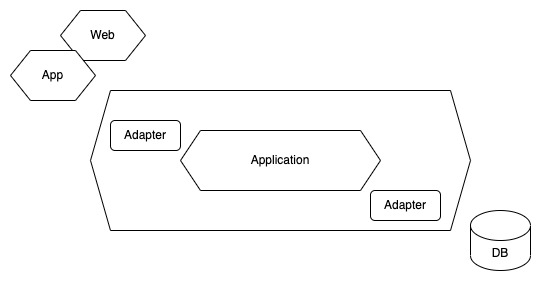
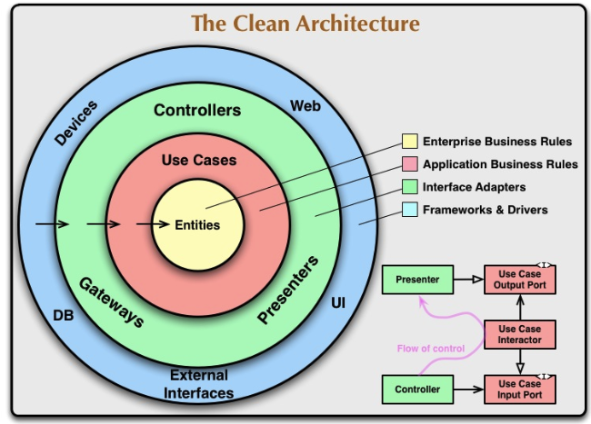
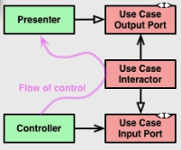

# アーキテクチャの役目

## アンチパターン：利口なUI
利口なUIは本来であればドメインオブジェクトに記載されるべき重要なルールやふるまいが、ユーザーインターフェースに記述されてしまっている状態で、ドメインを分離することが適わなかったアプリケーションに多く見られる。

そうしたシステムは改良に対するコストが異常に高くなってしまう。

## ドメイン駆動設計がアーキテクチャに求めること
利口なUIを避けることを決めたとしても容易ではない。ビジネスロジックを正しい場所に配置し続けることは、いかにその大切さを熟知している開発者であっても難しい。

それゆえ開発車に強い自制心を促す以外の方法を考える必要があり、アーキテクチャはその解決策になる。

アーキテクチャは方針で、何がどこに記述されるべきかといった疑問に対する回答を明確に、ロジックが無秩序に点在することを防ぐ。

開発者はアーキテクチャが示す方針にしたがうことで、「何をどこに書くのか」に振り回されないようになる。これは開発者がドメイン駆動設計の本質である「ドメインをとらえ、うまく表現する」ことに集中するために必要なこと。

ドメイン駆動設計がアーキテクチャに求めることは、ドメインオブジェクトが渦巻くレイヤーを隔離して、ソフトウェア特有の事情からドメインオブジェクトを防衛すること。

それを可能にするのであれば、アーキテクチャがどのようなものであっても構わない。

# アーキテクチャの解説
ドメイン駆動設計と同時に語られることの多いアーキテクチャは以下のとおり。

- レイヤードアーキテクチャ
- ヘキサゴナルアーキテクチャ
- クリーンアーキテクチャ

ドメイン駆動設計にとってはドメインが隔離されることのみが重要であり、必ずしもいずれかのアーキテクチャにしたがわなければいけないというわけではない。

またアーキテクチャにしたがったからといって、それすなわちドメイン駆動設計を実践したことにはならない。重要なのは、ドメインの本質に集中すること。

## レイヤードアーキテクチャ
ドメイン駆動設計の文脈で登場するアーキテクチャの中で、もっとも伝統的で有名なアーキテクチャで、その名のとおりいくつかの層が積み重なる形で表現される。


4つの層で構成されたものが代表的で、層の内訳は以下のとおり。

- プレゼンテーション層(ユーザーインターフェース層)
- アプリケーション層
- ドメイン層
- インフラストラクチャ層

### ドメイン層
この中でもっとも重要なそうで、ソフトウェアを適用しようとしている領域で問題解決に必要な知識を表現する。この層を明示的にして、ドメイン層に本来所属すべきドメインオブジェクトの隔離を促し、他の層へ流出しないようにする

### アプリケーション層
ドメイン層の住人を取りまとめる層でアプリケーションサービスが挙げられる。アプリケーションサービスはドメインオブジェクトの直接のクライアントとなり、ユースケースを実現するための進行役になる。

ドメイン層の住人はドメインの表現に徹しているので、アプリケーションとして成り立たせるためには彼らを問題解決に導く必要がある。そのような働きをするアプリケーション層はまさにドメイン層の住人を取りまとめる存在。

### プレゼンテーション層
ユーザーインターフェースとアプリケーションを結びつける。主な責務は表示と解釈で、システムの利用車にわかるように表示を行い、システム利用者の入力を解釈する。

ユーザーインターフェースとアプリケーションを結びつけることさえできれば、WebフレームワークであってもCLIであっても良い。

### インフラストラクチャ層

他の層を支える技術的基盤へのアクセスを提供するそうで、アプリケーションのためのメッセージ送信や、ドメインのための永続化を行うモジュールが含まれる。

### 解説

ここに存在する原則は依存の方向が上から下ということで、上位のレイヤーは自身より下位のレイヤーに依存することが許される。逆方向の直接的な依存は許されない。

ドメイン層からインフラストラクチャ層に依存の矢印が伸ばされているのは、ドメイン層のオブジェクトがインフラストラクチャ層のオブジェクトを取り扱うことを意味していない。

白抜きの矢印で汎化が含まれていることがわかり、リポジトリのインターフェースと実装クラスの関係がこの矢印にあたる。

### レイヤードアーキテクチャの実装サンプル(Laravelベース)

#### プレゼンテーション層に所属するコントローラー

```php
class UserController extends Controller
{
    private UserApplicationService $userApplicationService;

    public function __construct(UserApplicationService $userApplicationService)
    {
        $this->applicationService = $userApplicationService;
    }
    
	public function list(Request $request): UserListResponse
	{
    	$users = $this->userApplicationService->getAll();
    	return new UserListResponse($users);
	}

	public function index(UserGetRequest $request): UserGetResponse
	{
	    $command = new UserGetCommand($request->id);
    	$user = $this->userApplicationService->get($command);
    	return new UserGetResponse($user);
	}

	public function store(UserPostRequest $request): UserStoreResponse
	{
	    $command = new UserRegisterCommand($request->name);
    	$user = $this->userApplicationService->register($command);
    	return new UserStoreResponse($user);
	}

	public function update(UserUpdateRequest $request): void
	{
	    $command = new UserUpdateCommand($request->id, $request->name);
    	$this->userApplicationService->update($command);
	}
	
	public function destroy(UserDeleteCommand $request): void
	{
	    $command = new UserDeleteCommand($request->id);
    	$this->userApplicationService->delete($command);
	}
}
```

HTTPリクエストという利用者からの入力データをアプリケーションに伝えるための変換を行うMVCフレームワークのコントローラーは、入力を解釈してアプリケーションに結びつけるプレゼンテーション層の住人。

アプリケーションサービスのクライアントにもなっているので、依存の方向性も守られている。

#### アプリケーション層に所属するアプリケーションサービス

```php
class UserApplicationService
{
    private IUserFactory $userFactory;
    private IUserRepository $userRepository;
    private UserService $userService;
    
    public function __construct(IUserFactory $userFactory, IUserRepository $userRepository, UserService $userService)
    {
        $this->userFactory = $userFactory;
        $this->userRepository = $userRepository;
        $this->userService = $userService;
    }
    
    public function get(UserGetCommand $command): UserGetResult
    {
        $id = new UserId($command->id);
        $user = $this->userRepository->find($id);
        if ($user === null) {
            throw new UserNotFoundException($id, "ユーザーが見つかりませんでした");
        }
        return new UserGetResult($user);
    }
        
    public function getAll(): UserListResult
    {
        $users = $this->userRepository->findAll();
        return new UserListResult($users);
    }

    public function register(UserRegisterCommand $command): UserRegisterResult
    {
        $name = new UserName($command->name);
        $user = $this->userFactory->create($name);
        if ($this->userService->exists($user)) {
            throw new CannotRegisterUserException($user, 'ユーザーは既に存在しています');
        }
       
        $result = $this->userRepository->save($user); 
        return new UserRegisterResult($result);
    }

    public function update(UserUpdateCommand $command): void
    {
        $id = new UserId($command->id);
        $user = $this->userRepository->find($id);
        if ($user === null) {
            throw new UserNotFoundException($id, "ユーザーが見つかりませんでした");
        }

        $name = new UserName($command->name);
        $user->changeName($name);
        if ($this->userService->exists($user)) {
            throw new CannotRegisterUserException($user, 'ユーザーは既に存在しています');
        }
        
        $result = $this->userRepository->save($user); 
    }
    
    public function delete(UserDeleteCommand $command): void
    {
        $id = new UserId($command->id);
        $user = $this->userRepository->find($id);
        if ($user === null) {
            return;
        }

        $result = $this->userRepository->delete($user);
    }
}
```

アプリケーションサービスはアプリケーション層に所属するオブジェクトで、下位に位置するドメイン層とインフラストラクチャ層に対して依存している。

アプリケーション層は問題を解決するためにドメインオブジェクトが実施するタスクの進行管理を行う。

注意すべきはこのレイヤーにドメインのルールやふるまいを直接記述していはいけないことで、ビジネスの重要なルールはドメイン層に実装すべき。

#### ドメイン層

ユーザーのコード上の表現である`User`クラスやドメインサービスの`UserService`クラスはこの層に所属するオブジェクト

```php
class User
{
    private UserId $id;
    private UserName $name;
    private UserType $type;
    
    public function __construct(UserId $id, UserName $name, UserType $type)
    {
        $this->id = $id;
        $this->name = $name;
        $this->type = $type;    
    }
    
    public function changeName(UserName $name): void
    {
        $this->name = $name;
    }
    
    public function upgrade(): void
    {
        $this->type = UserType::Premium;
    }

    public function downgrade(): void
    {
        $this->type = UserType::Normal;
    }
}

class UserService
{
    private IUserRepository $userRepository;
    
    public function __construct(IUserRepository $userRepository)
    {
        $this->userRepository = $userRepository;
    }
    
    public function exists(User $user): bool
    {
        $duplicateUser = $this->userRepository->find($user->name);
        return $duplicateUser !== null;
    }
}
```

ドメインモデルに表現するコードはすべてこの層に集中する。またドメインオブジェクトをサポートする役割のあるファクトリやリポジトリのインターフェースもこの層に含まれる。

#### インフラストラクチャ

インフラストラクチャ層のオブジェクトは永続化を実施するリポジトリ。

```php
class EFUserRepository implements IUserRepository
{
    public function find(UserId $id): ?User
    {
        return  User::find($id);
    }
    
    // 割愛
}
```

インフラストラクチャ層にはドメインオブジェクトを直接的に支える技術的機能の他に、アプリケーション層やプレゼンテーション層のための技術的機能を担うオブジェクトも含まれる

## ヘキサゴナルアーキテクチャ

ヘキサゴナルアーキテクチャは六角形をモチーフとした図のように代表されるアーキテクチャで、コンセプトはアプリケーションとそれ以外のインターフェースや保存媒体は付け外しできるようにするというもの。



ゲーム機が良い例えで、ゲーム機にはコントローラやモニターといった利用者が直接触れることのできるインターフェースが存在する。それらは純正品でもサードパーティ製でもうまく動作する

記憶媒体にしても、内蔵されたハードディスク以外にクラウド上に保存することもできる。

インターフェースは例えばCUIやGUIなどがある。インタフェースの種類は多岐にわたるが、アプリケーションからしてみたら利用者の入力を伝えて、処理の結果を表示して伝えてくれるのであればそれが何であっても構わない。

記憶媒体にしても同様で、内蔵HDDでも外付けでも何でも構わない。ヘキサゴナルアーキテクチャはアプリケーション以外のモジュールはゲームコントローラーのように差し替え可能なもの。

入力インターフェースや記憶媒体が変更されても、コアとなるアプリケーションにその余波は及ばない。

ヘキサゴナルアーキテクチャはアダプタがポートの形状に合えば動作することに見立てて、ポートアンドアダプタと呼ばれることもある。この時アプリーケーションに対する入力を受け持つポートとアダプタをそれぞれプライマリポートとプライマリアダプターという。

反対にアプリケーションか外部に対してインタラクトするポートをセカンダリポートと表現し、実装するオブジェクトをセカンダリアダプタと呼ぶ。

```php
class UserApplicationService
{
    public function update(UserUpdateCommand $command): void
    {
        $id = new UserId($command->id);
        $user = $this->userRepository->find($id);
        if ($user === null) {
            throw new UserNotFoundException($id, "ユーザーが見つかりませんでした");
        }

        $name = new UserName($command->name);
        $user->changeName($name);
        if ($this->userService->exists($user)) {
            throw new CannotRegisterUserException($user, 'ユーザーは既に存在しています');
        }
        
        // セカンダリポートであるIUserRepositoryの処理を呼び出す
        // 処理は実態であるセカンダリアダプタに移る
        $result = $this->userRepository->save($user); 
    }
}
```

ユーザー情報更新である`Update`メソッドを呼び出すクライアントはプライマリアダプターで、`Update`
メソッドはプライマリーポートにあたる。プライマリアダプタはアプリケーションを操作するための値をプライマリポートが求める`UserUpdateCommand`に変換し、アプリケーションを呼び出す。

アプリケーションは`IUserRepository`というセカンダリポートを呼び出すことで、具体的な実装(セカンダリアダプタ)からインスタンスを再構築したり永続化を依頼する。

レイヤードアーキテクチャとの違いとして挙げられるのは、インターフェースを利用した依存関係の整理に言及している点。

レイヤードアーキテクチャは層分けを言及しているに過ぎなく、インターフェースを取り扱うかは全く任意。ただ、昨今のシステム開発の現場においてはレイヤードアーキテクチャでインターフェースを利用して、依存関係の逆転を達成することは当たり前のように行われているため、両者の垣根はほとんどないのげ現状。

## クリーンアーキテクチャ

クリーンアーキテクチャは4つの同心円が特徴的な図によって説明されるアーキテクチャ。



上図はビジネスルールをカプセル化したモジュールを中心に据えるというコンセプトで、図中の`Entities`はドメイン駆動設計のエンティティを示さない。

クリーンアーキテクチャの文脈で語られるエンティティは、ビジネスルールをカプセル化したオブジェクトないしデータ構造と関数のセットを指すので、ドメインオブジェクトに近い概念。

クリーンアーキテクチャはユーザインターフェースやデータストアなどの詳細を端に追いやり、依存の方向を内側に向けることで、詳細が抽象に依存するという依存関係逆転の原則を達成する。

ヘキサゴナルアーキテクチャと目的としているところが同じ。大きな違いは、その実装の仕方が詳しく言及されているか否か。

ヘキサゴナルアーキテクチャはポートとアダプタにより、付け外しを可能にするという方針だけがあったが、クリーンアーキテクチャにはコンセプトを実現する具体的な実装方針が明示されている。

図右下の図の矢印は2種類存在していて、片方は普通の矢印、もう片方は白抜きの矢印で、これはそれぞれ依存と汎化を表している。



`<I>`という記号もあり、汎化の矢印が伸びていることからモジュールがインターフェースであることを示す印になっている。Flow of controlはプログラムを実行した時の処理の流れを示している。

### 実装する

```php
interface IUserGetInputPort
{
    public function handle(UserGetInputData $inputData): void;
}
```

`InputPort`はクライアントのためのインターフェースでコントローラーから呼び出される。

`Interactor`はこの`InputPort`を実装してユースケースを実現する。

```php
class UserGetInteractor implements IUserGetInputPort
{
    private IUserRepository $userRepository;
    private IUserGetPresenter $presenter;
    
    public function __construct(IUserRepository $userRepository, IUserGetPresenter $presenter)
    {
        $this->userRepository = $userRepository;
        $this->presenter = $presenter;
    }
    
    public function handle(UserGetInputData $inputData)
    {
        $targetId = new UserId($inputData->userId);
        $user = $this->userRepository->find($targetId);
        
        $this->presenter->output(new UserGetOutputData($user));
    }
} 
```

`UserGetInteractor`はちょうどアプリケーションサービスのメソッドをそのままクラスにしたもので、これまでのアプリケーションサービスと異なる点は、結果を出力する先が`presenter`と呼ばれるオブジェクトになっている点。

`UserGetInteractor`は`IUserGetInputPort`を実装しているので、以下のようなスタブを作ることが可能。

```php
class StubUserGetInteractor implements IUserGetInputPort
{
    private IUserGetPresenter $presenter;
    
    public function __construct(IUserGetPresenter $presenter)
    {
        $this->presenter = $presenter;
    }
    
    public function handle(UserGetInputData $inputData)
    {
        $user = new User("test-id", "test-name");
        $this->presenter->output(new UserGetOutputData($user));
    }
}
```

クライアントは`IUserGetInputPort`越しに`Interactor`を呼び出すので、スタブに差し替えることでテストの実施が可能になる。

このようにてスタビリティを随所で確保することもクリーンアーキテクチャの重要なテーマ。

コンセプトでもっとも重要なことはビジネスルールをカプセル化したモジュールを中心に据え、依存の方向を絶対的に制御すること。これはヘキサゴナルアーキテクチャのコンセプトとほとんど同じ。

いずれにせよ、ドメイン駆動設計の文脈上で最も重要なことはドメインの隔離を促すことで、全ての詳細がドメインに対して依存するようにすることは、ソフトウェアの方針を最も重要なドメインに握らせることを可能にする。

# まとめ

アーキテクチャには共通点があり、それは一度に多くのことを考え過ぎないことで、アーキテクチャは方針を示し、各所で考える範囲を狭めることで集中を促す。

何をすべきかが明確になると、同時に考える余地もでてくる。アーキテクチャを採用することはより深いモデルの考察に時間を増やすことに寄与する。

ドメイン駆動設計においてアーキテクチャは主役ではなく、ドメインの隔離を促すことができるのであればどのようなものを採用しても構わない。

ソフトウェアにとって最も重要なことはシステムの利用者の必要を満たすことや問題の解決を実現することで、その本質に集中するために最適なアーキテクチャを選択することが重要。


